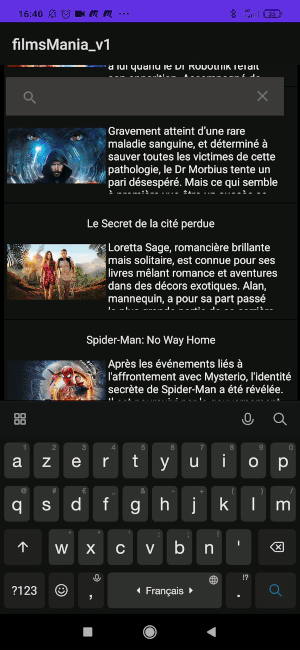
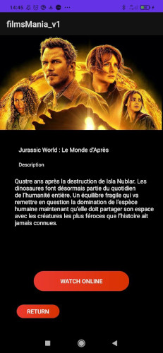
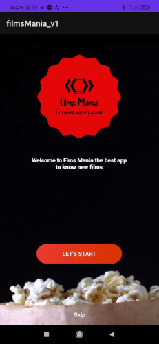
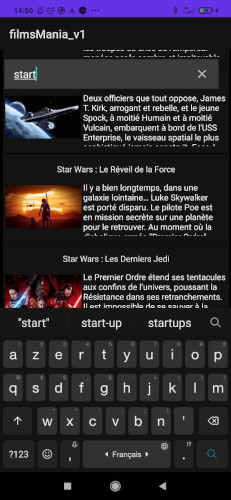
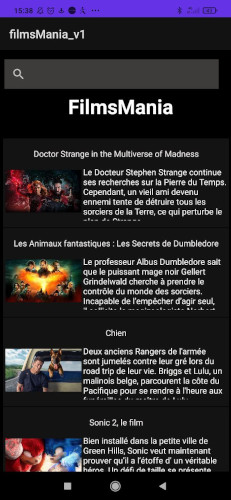

# TP ANDROID - FilmsMania
This is the repository for the work made on the classs of Android between the 14 June 2022 and 17 June
 Films Mania is an applecation to view the new films and to expore films
 
 

## A3 ALT1 -IIM 
##Edson Kennedy DE CARVALHO PEDRO

  

 
  

## Video preview 

 

## Preview 

 

## Permissions

On Android versions prior to Android 6.0, wallabag requires the following permissions:
- Full Network Access.
- View Network Connections.
- Run at startup.
- Read and write access to external storage.

The "Run at startup" permission is only used if Auto-Sync feature is enabled and is not utilised otherwise. The network access permissions are made use of for downloading content. The external storage permission is used to cache article images for viewing offline.

## License

This application is released under GNU GPLv3 (see [LICENSE](LICENSE)).
Some of the used libraries are released under different licenses.